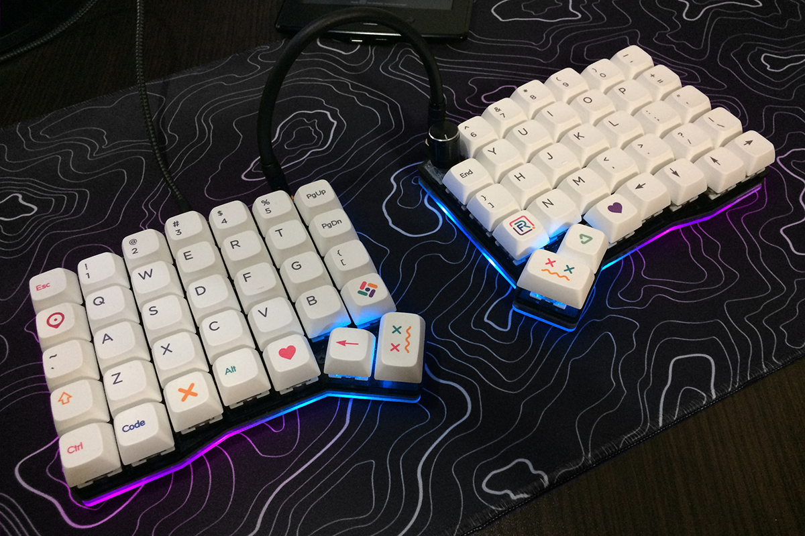

# Kapl Keyboard

The Kapl is a split ergonomic keyboard with 70 keys (7x5).
Please read project wiki for details: https://github.com/keyzog/kapl/wiki

**Detailed assembly instructions:** https://keyzog.com/post/kapl-build-guide (RU)

Board with controller on back side.

## PCB

[gerbers/gerber\_\_main.zip](https://github.com/keyzog/kapl/raw/main/gerbers/gerber__main.zip)

## Firmware

Kapl uses [QMK firmware](https://qmk.fm/)

## Todo

-  [x] [list of materials](https://github.com/keyzog/kapl/wiki#bill-of-materials)
-  [x] rotation encoder support
-  [ ] building guide
-  [ ] tilting-tenting case
