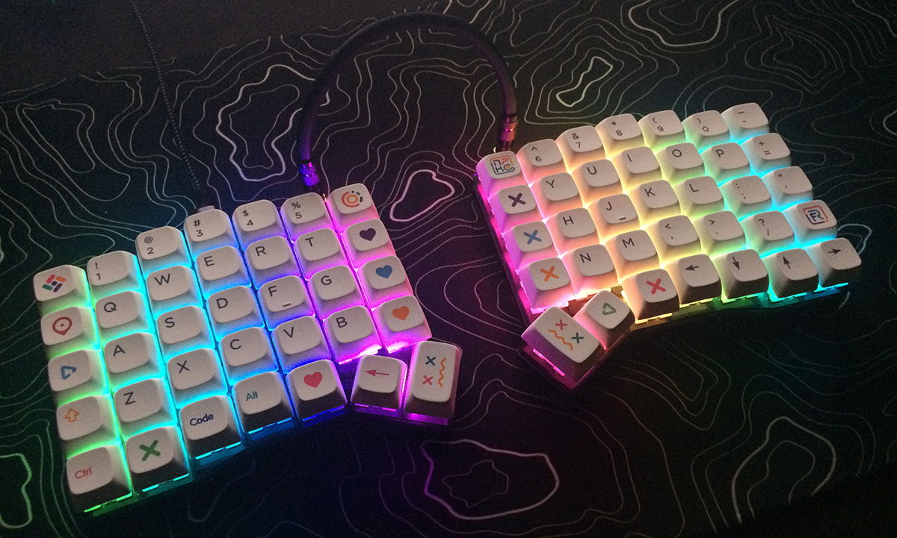
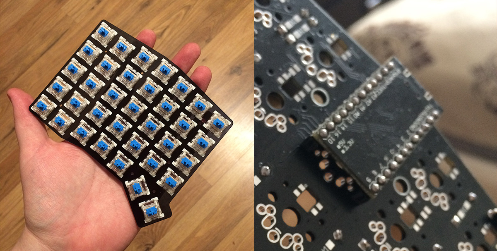
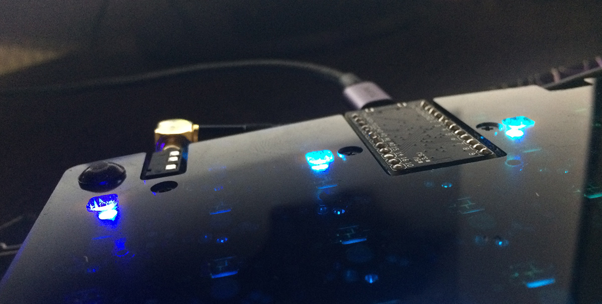
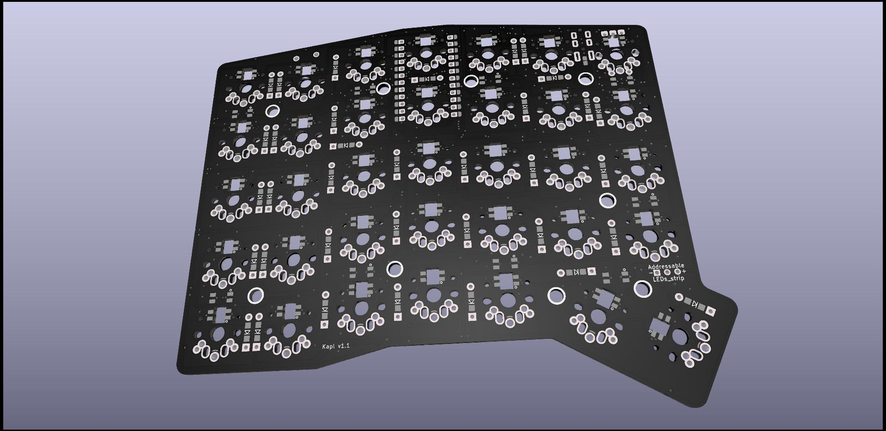
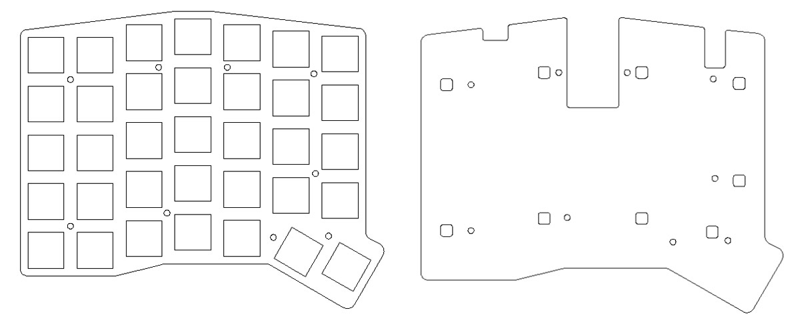
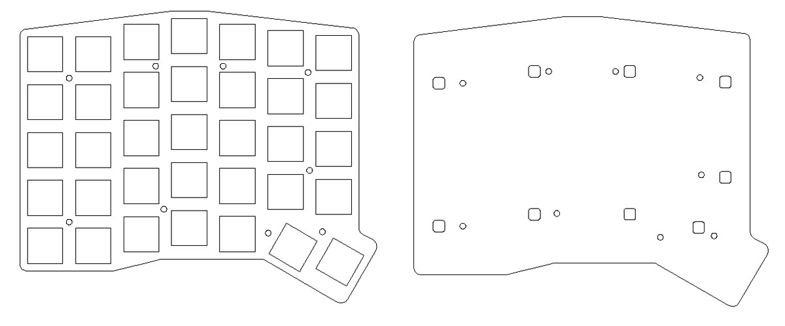

# Kapl Keyboard

The Kapl is a split ergonomic keyboard with 70 keys (7x5).

Board with controller on back side.

## PCB

[gerbers/gerber__main_1.0.zip](https://github.com/keyzog/kapl/raw/main/gerbers/gerber__main_1.0.zip)

I recommend ordering PCB on [jlcpcb.com](https://jlcpcb.com/).

## Acrylic Case

[dxf/case_with_cut/](https://github.com/keyzog/kapl/tree/main/dxf/case_with_cut/)

[dxf/case_base/](https://github.com/keyzog/kapl/tree/main/dxf/case_base/)

## Firmware
Kapl uses [QMK firmware](https://qmk.fm/)

## Todo
- [x] [list of materials](https://github.com/keyzog/kapl/wiki#bill-of-materials)
- [ ] building guide
- [ ] tilting-tenting case
- [ ] rotation encoder support 
